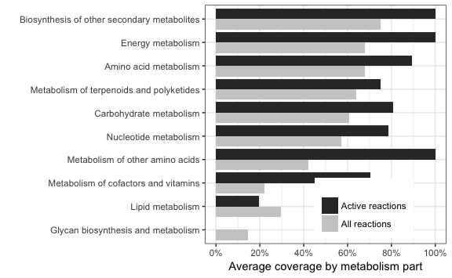

Figure 1 results
================
Aleksej Zelezniak
2018-10-19

A Deletion of Each of the 97 Non-essential Yeast Protein Kinases Triggers Broad and Quantitatively Strong Changes in Metabolic Enzyme Expression

    ## Warning: package 'tidyverse' was built under R version 3.4.2

    ## -- Attaching packages ------------------------------------------------------------------------------------------------------------------------------------------------------------------------------------------------------------ tidyverse 1.2.1 --

    ## <U+221A> ggplot2 2.2.1     <U+221A> purrr   0.2.5
    ## <U+221A> tibble  1.4.2     <U+221A> dplyr   0.7.6
    ## <U+221A> tidyr   0.8.1     <U+221A> stringr 1.3.1
    ## <U+221A> readr   1.1.1     <U+221A> forcats 0.3.0

    ## Warning: package 'tibble' was built under R version 3.4.3

    ## Warning: package 'tidyr' was built under R version 3.4.4

    ## Warning: package 'purrr' was built under R version 3.4.4

    ## Warning: package 'dplyr' was built under R version 3.4.4

    ## Warning: package 'stringr' was built under R version 3.4.4

    ## Warning: package 'forcats' was built under R version 3.4.3

    ## -- Conflicts --------------------------------------------------------------------------------------------------------------------------------------------------------------------------------------------------------------- tidyverse_conflicts() --
    ## x dplyr::filter() masks stats::filter()
    ## x dplyr::lag()    masks stats::lag()

    ## Warning: package 'scales' was built under R version 3.4.1

    ## 
    ## Attaching package: 'scales'

    ## The following object is masked from 'package:purrr':
    ## 
    ##     discard

    ## The following object is masked from 'package:readr':
    ## 
    ##     col_factor

    ## Warning: package 'gridExtra' was built under R version 3.4.1

    ## 
    ## Attaching package: 'gridExtra'

    ## The following object is masked from 'package:dplyr':
    ## 
    ##     combine

#### Loading data

``` r
#iMM904 yeast metabolic model
load("./data/iMM904._load_.RData")
#experiment metadata
load("./data/exp_metadata._clean_.RData")

#pathway coverage
load("./data/KEGG.pathways.analysis1.RData")
load("./data/kegg_categories._load_.RData")

#transcriptome vs proteome
load("./data/transcriptome.FC._clean_.RData")
load("./data/orf2ko._load_.RData")
load("./data/orf2name._clean_.RData")

#absolute proteome data
load(file = "./data/absolute_dataset._clean_.RData")

#protein data
load("./data/proteins.matrix.sva.0.5.1.RData")
load("./data/proteins.matrix.sva.0.5.1.FC.RData")

protein.matrix <- proteins.matrix.sva.0.5.1
proteins.FC <- proteins.matrix.sva.0.5.1.FC

iMM904[] <- lapply(iMM904, as.character)
```

### Figure 1A

``` r

data.raw = protein.matrix

data.raw = as.tibble(data.frame(ORF = row.names(data.raw), tbl_df(data.raw), stringsAsFactors = F))
data.long <- data.raw %>% gather(sample, value, -ORF) %>%
  mutate(signal = exp(value),
         type = ifelse(grepl(pattern = "mix", ignore.case = T, x = sample), 1, 0))

data.long.summary = data.long %>% group_by(ORF, type) %>% dplyr::summarise(CV = sd(signal, na.rm=T)/mean(signal, na.rm=T))

data.long %>%  distinct(type, sample) %>% group_by(type) %>%
  summarise(n = n())
#> # A tibble: 2 x 2
#>    type     n
#>   <dbl> <int>
#> 1    0.   364
#> 2    1.    33

toPlot <- data.long.summary %>% filter(ORF %in% iMM904$gene) %>% arrange(type, CV) %>% 
  group_by(type) %>% 
  mutate(rank = rank(-CV),
         cumsum_CV = cumsum(CV),
         frac_CV = cumsum_CV/sum(CV))
toPlot %>%  
  ggplot(aes(x = CV, y = frac_CV)) +
    geom_point(aes(colour = factor(type))) +
    scale_color_discrete(name="",
                         breaks=c(1, 0),
                         labels=c("33 entire experiment technical QC samples", 
                                  "364 kinase samples")) +
    theme_bw() +
    theme(legend.position = c(0.8,0.25), aspect.ratio = 1) +
    xlab("Coefficient of variation of proteins of entire dataset") +
    ylab("Cummulative percentage, %")  +
    scale_y_continuous(labels = scales::percent) +
    scale_x_continuous(labels = scales::percent)
```


### Figure 1C

``` r


KEGG.pathways.stats <- KEGG.pathways %>%
  group_by(pathway) %>% 
  summarize(EC.coverage  = length(unique(EC.number[is.inData == 1]))/length(unique(EC.number)),
            ORF.coverage = length(unique(ORF[is.inData == 1]))/length(unique(ORF)),
            EC.active  = length(unique(EC.number[is.Coupled == 1 ]))/length(unique(EC.number)),
            ORF.active = length(unique(ORF[is.Coupled == 1 ]))/length(unique(ORF)),
            EC.active.inData  = length(unique(EC.number[is.Coupled == 1 & is.inData == 1 ]))/length(unique(EC.number[is.Coupled == 1])))


KEGG.pathways.stats = left_join(KEGG.pathways.stats, kegg_categories, by="pathway")

selected = c("Amino acid metabolism",                       
             "Carbohydrate metabolism",                                          
             "Energy metabolism",                                      
             "Glycan biosynthesis and metabolism",                                    
             "Metabolism of cofactors and vitamins",       
             "Metabolism of other amino acids",                
             "Nucleotide metabolism",                                                         
             "Metabolism of terpenoids and polyketides",
             "Biosynthesis of other secondary metabolites",
             "Lipid metabolism")

#KEGG.pathways.f <- KEGG.pathways %>% filter(B %in% selected)

KEGG.pathways.stats.f  <- KEGG.pathways.stats %>% filter(B %in% selected)

KEGG.pathways.stats.f.long = KEGG.pathways.stats.f %>% 
  gather(stats, coverage, -pathway, -A, -B, -C)


toPlot = KEGG.pathways.stats.f.long %>% 
  filter(stats %in% c( "EC.active.inData", "EC.coverage")) %>%
  group_by(B, stats) %>%
  summarise(avg = mean(coverage, na.rm=T)) %>%
  ungroup() %>%
  arrange(avg)

arrange_vector = unique(as.character((toPlot %>% arrange(avg))$B))

toPlot <- toPlot %>% mutate(B =  fct_relevel(B, levels = arrange_vector))
toPlot <- toPlot %>% mutate(stats = fct_relevel(stats, rev(c("EC.active.inData", "EC.coverage"))))


ggplot(toPlot, aes(x=B, y=avg, fill=stats)) +
  geom_bar(stat="identity", position = "dodge") +
  scale_y_continuous(breaks = seq(0,1,0.2),labels = percent_format(), limits = c(0,1)) +
  xlab("") +
  ylab("Average coverage by metabolism part") +
  coord_flip() +
  scale_fill_grey(start = 0.8, 
                  end = 0.2,
                  name = "",
                  breaks = c("EC.active.inData", "EC.coverage"),
                  labels = c( "Active reactions", "All reactions")) +
  theme_bw() +
  theme(legend.position = c(.66, 0.15)) 
```

 \#\#\#Figure 1B

``` r
coverage_thr <- 0.1 # pathway considered present if at least 10% covered

toPlot <- KEGG.pathways.stats.f %>% 
  dplyr::select(A, EC.coverage, EC.active.inData) %>%
  gather(stats, coverage, -A) %>%
  group_by(stats) %>%
  summarise(MEAN_coverage = mean(coverage, na.rm = T))

toPlot$stats = factor(toPlot$stats, levels = c("EC.active.inData", "EC.coverage"))

toPlot2 <- KEGG.pathways.stats.f %>% 
  group_by(A) %>%
  summarise(pathways_coverage = sum(EC.coverage > coverage_thr, na.rm = T)/length(EC.coverage))

toPlot <- bind_rows(toPlot, rename(toPlot2, stats = A, MEAN_coverage = pathways_coverage))
toPlot <- toPlot %>% mutate(non_coverered = 1 - MEAN_coverage)
toPlot <- reshape2::melt(toPlot, id.vars = c("stats"))
toPlot <- toPlot %>% mutate( stats = fct_relevel(stats, levels = as.character((toPlot %>% filter(variable  == "MEAN_coverage") %>% 
                                                                arrange(value) %>% dplyr::select(stats))[,1])))

ggplot(toPlot, aes(x=stats, y=value, fill = variable)) +
  geom_bar(width = 1, stat = "identity") +
  coord_polar(theta = "y", start = pi/2 ) +
  scale_y_continuous(breaks = seq(0,1,0.25),labels = percent_format(), limits = c(0,1)) +
  theme_bw() +
  theme(legend.justification=c(1,0), 
        legend.position="none",
        legend.key.size =  unit(0.25, "cm"))+
  xlab("") +
  ylab("")
```


### Figure 1D

``` r


rowFolds = function(data, groups, reference) {
  
  ref_ind = which(groups == reference)
  
  if (length(ref_ind) == 0 ) {
    stop(paste("No such reference:", reference))
  }
  
  stopifnot(length(unique(groups)) >=2)  
    
  tmp_mat=data.frame(zero = rep(0,nrow(data)))
  ref_row = rowMeans(data[,ref_ind],na.rm=T)
  
  for (i in levels(groups)) {
    if (i == reference) {
      next
    }
    
    condition_index = which(groups == i)
    ret=c()
    if (length(condition_index) == 1 ){
      ret = data[,condition_index]/ref_row
    } else {
      ret = rowMeans(data[,condition_index],na.rm=T)/ref_row  
    }
    tmp_mat = cbind(tmp_mat,ret)  
  }
  tmp_mat$zero = NULL
  colnames(tmp_mat) = levels(groups)[levels(groups) != reference]
  
  return(tmp_mat)  
}


getFC_thr = function(proteins.matrix, pval_thr = 0.01) {
    
   
  #checking WT samples to define FC
  exp_metadata$aquisition_date.str = as.POSIXct(strftime(exp_metadata$aquisition_date, format="%Y-%m-%d %H:%M:%S"))
  cl = cluster::pam(exp_metadata$aquisition_date.str, 7)
  exp_metadata$batch_kmeans = cl$clustering
  
  pheno_wt = as.data.frame(exp_metadata[match(colnames(proteins.matrix), exp_metadata$sample_name),])
  pheno_wt = pheno_wt[pheno_wt$type == "Standard Mix",]
  pheno_wt = pheno_wt[pheno_wt$batch_kmeans %in% names(table(pheno_wt$batch_kmeans))[table(pheno_wt$batch_kmeans)  >= 3],]
  
 
  proteins.matrix.WT = proteins.matrix[,match(pheno_wt$sample_name, colnames(proteins.matrix))]

  pheno_wt$factor = factor(paste(pheno_wt$ORF, pheno_wt$batch_kmeans, sep="."))
  
  X = model.matrix(~factor + 0, data=pheno_wt)
  colnames(X) = levels(pheno_wt$factor)
  
  tbl.tmp = table(pheno_wt$factor)
  reference = names(tbl.tmp)[tbl.tmp == max(tbl.tmp)][1]
  
  matrix = proteins.matrix.WT

  lm.fit_model = limma::lmFit(matrix, X)
  ph = unique(as.character(pheno_wt$factor))
  contrasts = paste0( ph[ph !=reference] ,"-", reference)  
  
  mc = limma::makeContrasts(contrasts=contrasts, levels=X)    
  c.fit = limma::contrasts.fit(lm.fit_model, mc)
  eb = limma::eBayes(c.fit)
  
  folds = rowFolds(data=exp(matrix), groups=pheno_wt$factor, reference=reference)
  folds = log(folds, 2)
  
  folds_tmp = reshape2::melt(eb$coefficients, id.vars="row.names")
  pvals_tmp = reshape2::melt(eb$p.value, id.vars="row.names")
  
  names(folds_tmp) = c("ORF", "contrasts", "logFC")
  names(pvals_tmp) = c("ORF", "contrasts", "p.value")
  
  folds_tmp$contrasts = factor(folds_tmp$contrasts)
  pvals_tmp$contrasts = factor(pvals_tmp$contrasts)
  
  proteins.FC = merge(folds_tmp, pvals_tmp, all=T,
                      by=c("ORF", "contrasts"))
  
  
  ##multiple testing correction
  proteins.FC$p.value_BH = p.adjust(proteins.FC$p.value, method="BH")
  proteins.FC$p.value_bonferroni = p.adjust(proteins.FC$p.value, method="bonferroni")
  
  proteins.FC$KO = sub(x = proteins.FC$contrasts, pattern=paste("(.*?)-", reference, sep=""), replacement="\\1")
  proteins.FC$reference = reference
  
  proteins.FC_MIX <<- proteins.FC
  data = abs(proteins.FC$logFC[proteins.FC$p.value_BH < pval_thr])
  fc_thr = median(data)

  return(abs(fc_thr))
}


reference = unique(as.character(proteins.FC$reference))
proteins.FC.f <- proteins.FC %>% 
  filter(KO %in% unique(exp_metadata$ORF[exp_metadata$type == "Kinase"])) %>%
  mutate(isiMM904 = ORF %in% unique(as.character(iMM904$gene)))

pval_thr = 0.01

FC_thr = getFC_thr(proteins.matrix=protein.matrix, pval_thr=pval_thr)


p.volcano <- proteins.FC.f %>% 
  filter(isiMM904 == T) %>%
  mutate(sign = ifelse(abs(logFC) >= FC_thr & p.value_BH < pval_thr, 1,0)) %>%
  ggplot(aes(y=-log10(p.value_BH), x=logFC)) +
  geom_point(aes(color = sign), alpha=0.5) + 
  xlim(c(-4,4)) +
  geom_hline(yintercept = -log(pval_thr,10),linetype=3) +
  geom_vline(xintercept = c(FC_thr,-FC_thr),linetype=3) +
  xlab("Protein expression change in mutant, log2(fold-change)") +
  theme_bw() +
  theme(axis.line = element_line(colour = "black"),
        panel.grid.major = element_blank(),
        panel.grid.minor = element_blank(),
        panel.background = element_blank(),
        aspect.ratio = 1,
        legend.position = "none")

p.inset <- proteins.FC.f %>% 
  filter(isiMM904 == T) %>%
  ggplot( aes(x=logFC)) +
  geom_histogram(colour = "white", fill = "black", binwidth = 0.25) +
  xlab(paste("Log2(fold-change)")) +
  xlim(c(-2,2)) +
  theme_bw() +
  theme(aspect.ratio = 1)

grid.arrange(p.volcano, p.inset, ncol=2)
```

 \#\#\#Figure 1F

``` r

proteins.FC.f.stats <- proteins.FC.f %>% 
  group_by(KO) %>%
  filter(abs(logFC) >= FC_thr, p.value_BH < pval_thr) %>% 
  summarize(n_yeast  = sum(isiMM904),
            n_total = n()) %>%
            mutate(n_yeast_fraction = n_yeast/n_total)

proteins.FC.f.stats  %>%
 ggplot(aes(x = n_total, y = n_yeast_fraction)) +
  geom_point() +
  geom_smooth(method = "lm", se = F) +
  ggtitle(with(proteins.FC.f.stats, cor(n_total, n_yeast_fraction))) +
  xlab("Number of proteins changes per mutant") +
  ylab("Fraction of metabolic enzymes affected by kinase") +
  theme_bw() +
  theme(aspect.ratio = 1 - 1/3.14)
```


### Figure 1G

``` r

transcriptome.FC <- transcriptome.FC %>% dplyr::select(c("ORF", "logFC", "p.value", "p.value_BH", "KO.ORF"))
transcriptome.FC <- transcriptome.FC %>% dplyr::rename(KO = KO.ORF)

transcriptome.FC <- transcriptome.FC %>% mutate(isiMM904 = ORF %in% iMM904$gene)
transcriptome.FC.f = transcriptome.FC %>% filter(KO %in% unique(as.character(exp_metadata$ORF[exp_metadata$type == "Kinase"])))


proteins.FC = proteins.matrix.sva.0.5.1.FC 
tr.pr.FC = merge(transcriptome.FC, proteins.FC, by=c("KO", "ORF"), suffixes=c(".tr", ".pr"))

#pval_thr = 0.01

tr.pr.cor.KO = tr.pr.FC %>% group_by(KO, isiMM904) %>% 
  summarise(cor = cor(logFC.tr, logFC.pr, method="pearson"))

tr.pr.cor.KO %>% filter(isiMM904) %>%
ggplot(aes(x = cor)) +
  geom_histogram(colour = "white", fill = "black", binwidth = 0.05) +
  geom_vline(aes(xintercept = median(cor)), col="red", linetype = 2) +
  xlab(expression(paste("Pearson correlation between gene and protein expression changes, ", r))) +
  theme_bw() +
  theme(aspect.ratio = 1)
```

 \#\#\#Figure 1E

``` r
absolute_dataset <- absolute_dataset %>% mutate(isiMM904 = ORF %in% iMM904$gene)

absolute_dataset.stats <- absolute_dataset %>% 
  group_by(dataset, isiMM904) %>%
    summarize(n = n(), 
              perturbation = sum(abundance)) %>%
  group_by(dataset) %>%
    mutate(total_perturbation = sum(perturbation)) %>%
  group_by(dataset, isiMM904) %>%
    mutate(perturbation_fr = perturbation/total_perturbation)

absolute_dataset.f <- absolute_dataset %>% filter(dataset == "Kulak")


abs_changes <- proteins.FC.f %>% 
  left_join(absolute_dataset.f, by = c("ORF", "isiMM904")) %>%
  mutate(absolute_change = ifelse(p.value_BH < pval_thr, abundance * (2^logFC), abundance),
         percent_change = (absolute_change - abundance)/abundance) %>% 
  group_by(KO) %>%
  summarise(change = (sum(absolute_change, na.rm = T) - sum(abundance, na.rm=T))/sum(abundance, na.rm=T),
            median_change = median(abs(percent_change), na.rm=T),
            mean_change = mean(abs(percent_change), na.rm=T),
            max_change = max(abs(percent_change), na.rm=T))


abs_changes <- abs_changes %>% mutate(label = as.character(exp_metadata$gene[match(KO, exp_metadata$ORF)]))


counts <- proteins.FC.f %>%
            mutate(sign = ifelse(abs(logFC) >= FC_thr & p.value_BH < pval_thr, 1, 0),
                   label = orf2name$gene_name[match(KO, orf2name$ORF)])
counts.stats <- counts %>%
  filter(isiMM904) %>% 
  group_by(label) %>%
  summarize(n = sum(sign)) %>% 
  ungroup() %>% 
  arrange(-n)

counts.stats$label = factor(counts.stats$label, levels = as.character(counts.stats$label))

toPlot <- full_join(counts.stats, abs_changes)
#> Joining, by = "label"
toPlot$change_percent <- toPlot$change*100
toPlot <- toPlot %>% arrange(-n)
toPlot$label = factor(toPlot$label, levels = as.character(toPlot$label))

ggplot(toPlot, aes(x=label, y=n)) + 
  geom_bar(stat="identity", width=.5, color = "lightgrey") +
  geom_line(data=toPlot, aes(x = label, y = change_percent, group=1), colour = "red") +
  geom_text(data=data.frame(), 
            aes(x=toPlot$label[which.max(toPlot$change_percent)], 
                y = toPlot$change_percent[which.max(toPlot$change_percent)], 
                label = round(toPlot$change_percent[which.max(toPlot$change_percent)],3))) +
  geom_text(data=data.frame(), 
            aes(x=toPlot$label[which.min(toPlot$change_percent)], 
                y = toPlot$change_percent[which.min(toPlot$change_percent)], 
                label = round(toPlot$change_percent[which.min(toPlot$change_percent)],3))) +
  ylab("Number of perturbed metabolic enzymes") +
  xlab("Kinase mutant") +
  theme_bw() +
  theme(axis.text.x = element_text(angle = 90, hjust = 1, face = "italic"), aspect.ratio = 5/8)
```


``` r
sessionInfo()
#> R version 3.4.0 (2017-04-21)
#> Platform: x86_64-apple-darwin15.6.0 (64-bit)
#> Running under: macOS  10.13.5
#> 
#> Matrix products: default
#> BLAS: /Library/Frameworks/R.framework/Versions/3.4/Resources/lib/libRblas.0.dylib
#> LAPACK: /Library/Frameworks/R.framework/Versions/3.4/Resources/lib/libRlapack.dylib
#> 
#> locale:
#> [1] C
#> 
#> attached base packages:
#> [1] stats     graphics  grDevices utils     datasets  methods   base     
#> 
#> other attached packages:
#>  [1] bindrcpp_0.2.2  gridExtra_2.3   scales_0.5.0    forcats_0.3.0  
#>  [5] stringr_1.3.1   dplyr_0.7.6     purrr_0.2.5     readr_1.1.1    
#>  [9] tidyr_0.8.1     tibble_1.4.2    ggplot2_2.2.1   tidyverse_1.2.1
#> 
#> loaded via a namespace (and not attached):
#>  [1] tidyselect_0.2.4 reshape2_1.4.3   haven_1.1.1      lattice_0.20-35 
#>  [5] colorspace_1.3-2 htmltools_0.3.6  yaml_2.2.0       utf8_1.1.3      
#>  [9] rlang_0.2.2      pillar_1.2.1     foreign_0.8-69   glue_1.3.0      
#> [13] modelr_0.1.1     readxl_1.0.0     bindr_0.1.1      plyr_1.8.4      
#> [17] munsell_0.4.3    gtable_0.2.0     cellranger_1.1.0 rvest_0.3.2     
#> [21] codetools_0.2-15 psych_1.8.4      evaluate_0.10.1  labeling_0.3    
#> [25] knitr_1.20       parallel_3.4.0   broom_0.4.4      Rcpp_0.12.18    
#> [29] backports_1.1.2  limma_3.34.9     jsonlite_1.5     mnormt_1.5-5    
#> [33] hms_0.4.1        digest_0.6.15    stringi_1.2.2    grid_3.4.0      
#> [37] rprojroot_1.3-2  cli_1.0.0        tools_3.4.0      magrittr_1.5    
#> [41] lazyeval_0.2.1   cluster_2.0.6    crayon_1.3.4     pkgconfig_2.0.1 
#> [45] xml2_1.2.0       lubridate_1.7.4  assertthat_0.2.0 rmarkdown_1.9   
#> [49] httr_1.3.1       rstudioapi_0.7   R6_2.2.2         nlme_3.1-131.1  
#> [53] compiler_3.4.0
```
