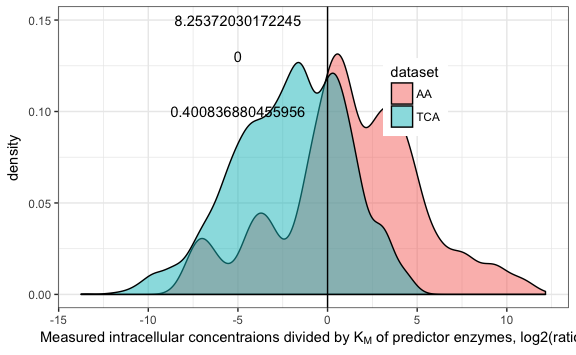

Figure 4 results
================
Aleksej Zelezniak
2018-10-19

Multiple Linear Regression Identifies Multivariate Metabolite-Enzyme Relationships That Are Informative about Metabolite Concentration

    ## Warning: package 'tidyverse' was built under R version 3.4.2

    ## -- Attaching packages ------------------------------------------------------------------------------------------------------------------------------------------------------------------------------------------------------------ tidyverse 1.2.1 --

    ## <U+221A> ggplot2 2.2.1     <U+221A> purrr   0.2.5
    ## <U+221A> tibble  1.4.2     <U+221A> dplyr   0.7.6
    ## <U+221A> tidyr   0.8.1     <U+221A> stringr 1.3.1
    ## <U+221A> readr   1.1.1     <U+221A> forcats 0.3.0

    ## Warning: package 'tibble' was built under R version 3.4.3

    ## Warning: package 'tidyr' was built under R version 3.4.4

    ## Warning: package 'purrr' was built under R version 3.4.4

    ## Warning: package 'dplyr' was built under R version 3.4.4

    ## Warning: package 'stringr' was built under R version 3.4.4

    ## Warning: package 'forcats' was built under R version 3.4.3

    ## -- Conflicts --------------------------------------------------------------------------------------------------------------------------------------------------------------------------------------------------------------- tidyverse_conflicts() --
    ## x dplyr::filter() masks stats::filter()
    ## x dplyr::lag()    masks stats::lag()

    ## Warning: package 'scales' was built under R version 3.4.1

    ## 
    ## Attaching package: 'scales'

    ## The following object is masked from 'package:purrr':
    ## 
    ##     discard

    ## The following object is masked from 'package:readr':
    ## 
    ##     col_factor

    ## Warning: package 'gridExtra' was built under R version 3.4.1

    ## 
    ## Attaching package: 'gridExtra'

    ## The following object is masked from 'package:dplyr':
    ## 
    ##     combine

``` r
#iMM904 yeast metabolic model
load("./data/iMM904._load_.RData")

#experiment metadata
load("./data/exp_metadata._clean_.RData")

brenda <- read_delim("./data/brenda.txt", delim = "\t")
#> Parsed with column specification:
#> cols(
#>   ecNumber = col_character(),
#>   kmValue = col_double(),
#>   kmValueMaximum = col_double(),
#>   substrate = col_character(),
#>   KEGGID = col_character(),
#>   commentary = col_character(),
#>   organism = col_character(),
#>   ligandStructureId = col_integer(),
#>   literature = col_character()
#> )

#protein data
load("./data/proteins.matrix.sva.0.5.1.RData")
load("./data/proteins.matrix.sva.0.5.1.FC.RData")

#metabolite data
load("./data/dataTCA.create_datasets.RData")
load("./data/dataAA.create_datasets.RData")


#models
load("./data/all_final_models.models.data_prep.RData")
load("./data/all_linear_models.data_prep.RData")
#example data
load("./data/prediction.intervals.data_prep.RData")
load("./data/prediction.models.data_prep.RData")

proteins.FC <- proteins.matrix.sva.0.5.1.FC
proteins.FC.f <- proteins.FC %>% 
  filter(KO %in% unique(exp_metadata$ORF[exp_metadata$type == "Kinase"])) %>%
  mutate(isiMM904 = ORF %in% unique(as.character(iMM904$gene)))

#ID maps
metabolite.order <- read_delim("./data/metabolites.txt", delim = "\t")
#> Parsed with column specification:
#> cols(
#>   met_name = col_character(),
#>   metabolite = col_character(),
#>   pathway = col_character(),
#>   method = col_character(),
#>   Order = col_integer()
#> )
load("./data/orf2name._clean_.RData")
load("./data/metabolite2iMM904._load_.RData")
load("./data/gene.annotations._load_.RData")
load("./data/GO.raw._load_.RData")


iMM904[] <- lapply(iMM904, as.character)

measured.proteins <- as.character(unique(proteins.FC.f$ORF))
metabolite.order = metabolite.order[with(metabolite.order,order(desc(method),pathway,Order, met_name)),]
```

``` r
metabolite.order = metabolite.order[with(metabolite.order,order(desc(method),pathway,Order, met_name)),]

toPlot = all_linear_models %>% ungroup() %>% 
  filter(metabolite %in% metabolite.order$metabolite, 
         degree== 1, ismetIncluded == 0, the_super_best == T, isImputed == 0 , isAutocorrelation.bonferoni == 0) %>% 
  distinct(metabolite, adj.r.squared)
            

toPlot <- toPlot %>% mutate(met_name = metabolite.order$met_name[match(metabolite, metabolite.order$metabolite)],
                            met_name = fct_relevel(met_name, levels=as.character(metabolite.order$met_name)),
                            pathway = metabolite.order$pathway[match(metabolite, metabolite.order$metabolite)],
                            pathway = fct_relevel(pathway,levels = unique(as.character(metabolite.order$pathway))))


toPlot %>%
  ggplot(aes(x = met_name, color=pathway)) +
    geom_linerange(data = toPlot , aes(ymin=0, ymax=adj.r.squared),size=3) +
    scale_colour_tableau("tableau20") +
    coord_flip() +
    theme_bw() + 
    theme(legend.justification=c(1,0), 
          legend.position=c(-0.1,0),
          panel.grid = element_blank()) +
    ylab("Explained variance of metabolite concentrations\nusing proteome data, adj. R2")
```


### Related to Figure 4B and Figure S15

``` r


selected_models  = dplyr::filter(all_final_models.models, type == "after", 
                        metabolite %in% metabolite.order$metabolite, 
                        adj.r.squared > 0.25, the_best == T, degree == 1)

selected_models %>%
ggplot() +
  geom_text(data=selected_models, aes(x=factor(model), y = varname, label=round(stats_text,2))) +
  geom_point(data=selected_models, aes(x=factor(model), y = varname, 
                              size=abs(coefficients), color = factor(mode))) +
  facet_wrap(dataset~metabolite.label, scales="free", ncol=5) +
  xlab("Candidate model") + 
  ylab("Enzyme predictors") +
  theme_bw() + 
  theme(aspect.ratio = 1, legend.position = "bottom") +
  scale_size_continuous(name="Effect size",
                        breaks=c(0.25, 0.5, 1),
                        labels = c("low", "medium", "strong")) +
  scale_color_discrete(name="Predictor's effect",
                       breaks = c(0, 1),
                       labels = c("negative", "positive") )
```


``` r


toPlot = prediction.models
stats.text = prediction.models %>% group_by(metabolite, model) %>% summarise(adj.r.squared = as.numeric(as.character(adj.r.squared[1])),
                                                                             median.cv.r2 = as.numeric(as.character(median.cv.r2[1])))
stats.text$x = -1
stats.text$y = seq(2,1,length.out=nrow(stats.text))
#toPlot$metabolite = factor(toPlot$metabolite, levels = c("ATP", "ADP", "AMP"))

toPlot$metabolite = factor(toPlot$metabolite, levels = c("ATP", "ADP", "AMP", "glutamine"))
prediction.intervals$metabolite = factor(prediction.intervals$metabolite, levels = c("ATP", "ADP", "AMP", "glutamine"))

ggplot(prediction.intervals) +
  geom_point(data = toPlot, aes(x = yhat, y = y) ) +
  geom_text(data=stats.text, aes(x=x,y=y,label=round(adj.r.squared,2)))+
  facet_wrap(~metabolite, nrow = 1, scale="free") +
  ylim(c(-5.5,5.5)) +
  xlim(c(-2.5,2.5)) + 
  xlab("Predicted metabolite levels,\nstandartized value") +
  ylab("Observed metabolite levels, standartized value") +
  geom_smooth(data = prediction.intervals, aes(x = yhat, y = yhat, ymin = pred.lwr, ymax = pred.upr), stat = "identity") + 
  theme(aspect.ratio = 1)
```


### Figure 4G

``` r


ec.gene = unique(gene.annotations[gene.annotations$V3 == "EC number",c(1,4)]) %>% setNames(c("ecNumber", "ORF"))
ec.gene[] <- lapply(ec.gene,as.character)


brenda.f <- brenda %>% filter(KEGGID != "") %>% filter(!grepl(pattern="mutant|recombinant", x=commentary)) # removing non-native enzymes


metabolitesTCA.long = reshape2::melt(dataTCA$metabolites) %>% 
  setNames(c("sample", "metabolite_id", "value")) %>%
  mutate(dataset = "TCA")

metabolitesAA.long = reshape2::melt(dataAA$metabolites) %>% 
  setNames(c("sample", "metabolite_id", "value")) %>%
  mutate(dataset = "AA")

# adjust concentration with volume and OD from this paper: doi:10.1016/j.funbio.2009.11.002
my.vol = c(median = 45.54, sd = 0.9) * 1e-15 # cell vol
my.cells = 3.2 * 10^7 * 1.5*5 #  median of spectrophotometre data Markus collected 5 ml of culture with od600  of 1.5
ex.vol = 100*1e-6

metabolitesTCA.long <- metabolitesTCA.long %>% mutate(concentration = value*ex.vol/(my.cells*my.vol[1])/1000) # mM

#different dilution used fot AA protocol
ex.vol = 400*1e-6 # correct dilution factor

metabolitesAA.long <- metabolitesAA.long %>% mutate(concentration = value*ex.vol/(my.cells*my.vol[1])/1000) # mM
metabolites.long <- bind_rows(metabolitesAA.long, metabolitesTCA.long)
metabolites.long <- left_join(metabolites.long, metabolite2iMM904 %>% select(id, kegg_id) %>% distinct(), by  = c("metabolite_id" = "id" )) 
metabolites.long = left_join(brenda.f, metabolites.long, c("KEGGID"="kegg_id"))
  
  
models.summary = all_linear_models %>% filter(degree==1, ismetIncluded == 0,  the_super_best)
models.summary = models.summary[models.summary$variables != "stats",]

brenda_dataset <- metabolites.long %>% ungroup() %>%
  dplyr::select(ecNumber, kmValue, substrate, KEGGID, sample, metabolite_id, value, dataset, concentration) %>% left_join(ec.gene) %>%
  filter(ORF %in% measured.proteins, ORF %in% unique(iMM904$gene)) %>%
  left_join(models.summary %>% ungroup() %>% select(metabolite, variables) %>% cbind(isPredictor = T), by = c("ORF" = "variables", "metabolite_id" = "metabolite")) %>%
  mutate(isPredictor = ifelse(is.na(isPredictor), F, T))
#> Joining, by = "ecNumber"
  
brenda_dataset <- brenda_dataset %>% filter(kmValue > 0)
brenda_dataset <- brenda_dataset %>% mutate(label = metabolite2iMM904$official_name[match(KEGGID, metabolite2iMM904$kegg_id)])
brenda_dataset <- brenda_dataset %>% mutate(ratio = concentration/kmValue)

toPlot = brenda_dataset
points = brenda_dataset %>% filter(isPredictor == T)

stats = data.frame(label_text = c(median(toPlot$ratio[toPlot$dataset == "AA"], na.rm=T)/median(toPlot$ratio[toPlot$dataset == "TCA"], na.rm=T),
                                  wilcox.test(log(toPlot$ratio[toPlot$dataset == "AA"]), log(toPlot$ratio[toPlot$dataset == "TCA"]))$p.value,
                                  sum(log(toPlot$ratio,2) > 0, na.rm=T)/length(toPlot$ratio)), #associated enzymes above Km
                   x = -7,
                   y = c(0.15, 0.13, 0.1))

ggplot() +  
  geom_density(data=toPlot, aes(x=log(ratio,2), fill=dataset), alpha = 0.5) +
  geom_text(data=stats, aes(x=x+2, y=y, label = label_text)) +
  xlab(expression(paste("Measured intracellular concentraions divided by ", K[M], " of predictor enzymes, log2(ratio)"))) +
  geom_vline(xintercept = 0) +
  theme_bw() +
  theme( legend.position = c(0.7,0.7))
```



### Figure 4F

``` r
# ### ratio whether it is predictor of not
a = (brenda_dataset %>% filter(isPredictor == F) %>% dplyr::select(ratio))$ratio
b = (brenda_dataset %>% filter(isPredictor == T) %>% dplyr::select(ratio))$ratio
# 
toPlot = brenda_dataset
stats = data.frame(label_text = c(median(b,na.rm=T)/median(a, na.rm=T),
                                   wilcox.test(b,a)$p.value),
                    x = 1,
                    y = c(5,4))
 
ggplot(toPlot, aes(x = isPredictor, y = log(ratio,2))) + 
 geom_boxplot(width=0.2)+
 geom_violin(alpha=0)+
 geom_text(data=stats, aes(x=x, y=y, label = label_text)) +
 theme(aspect.ratio = 8/3)
```


### Figure 4H

``` r

tRNAs <- right_join(orf2name, GO.raw[grep(pattern = "tRNA", x = GO.raw$V10),] %>%  dplyr::select(V2) %>% distinct(), by=c("sgd" = "V2"))


yeast.model = iMM904
AA.linear_models = all_linear_models %>% ungroup() %>% 
  filter(metabolite %in% metabolite.order$metabolite, 
         degree== 1, ismetIncluded == 0, isImputed == 0,
         isAutocorrelation.bonferoni == 0, dataset == "AA")

proteogenic_AA = metabolite2iMM904[grep(x = metabolite2iMM904$model_name, pattern = "-L|gly"),]  %>% 
  filter(!(id %in% c("Malate", "citrulline","homo.cysteine", "homo.serine"))) 

AA.linear_models$isProteogenic <- ifelse(AA.linear_models$metabolite %in% proteogenic_AA$id, 1, 0)

tRNAs <- right_join(orf2name, GO.raw[grep(pattern = "tRNA", x = GO.raw$V10),] %>%  dplyr::select(V2) %>% distinct(), by=c("sgd" = "V2"))


AA.linear_models = all_linear_models %>% ungroup() %>% 
  filter(metabolite %in% metabolite.order$metabolite, 
         degree== 1, ismetIncluded == 0, isImputed == 0,
         isAutocorrelation.bonferoni == 0, dataset == "AA")

tRNA_predictors <- AA.linear_models %>% 
  filter(variables %in% tRNAs$ORF) %>% 
  dplyr::select(metabolite, variables) %>% distinct() %>% 
  left_join(ec.gene, by = c("variables" = "ORF"))
names(tRNA_predictors) <- c("metabolite", "gene_name", "ec")
  
# checking for saturation


points = brenda_dataset %>% filter(isPredictor == T)
points2 = inner_join(points, tRNA_predictors, by = c("metabolite_id" = "metabolite", "ecNumber" = "ec"))
toPlot <- points2

toPlot %>%
  ggplot(aes(x=log(ratio), fill = label)) +  
    geom_density(alpha = 0.5) +
    geom_vline(xintercept = 0) +
    scale_fill_discrete(name = "") +
    xlab(expression(paste("Measured intracellular concentraions divided by ", K[M], " of tRNA charging enzymes, ln(ratio)"))) +
    theme_bw() +
    theme(legend.position = c(0.6, 0.7), legend.background = element_rect(color = NULL), legend.direction = "horizontal")

ordering <- toPlot %>% group_by(label) %>% 
  mutate(median_ratio = median(log(ratio), na.rm=T)) %>%  ungroup() %>%
  arrange(median_ratio) %>% dplyr::select(label) %>% distinct()


toPlot %>% 
  mutate(label = fct_relevel(label, levels = rev(as.character(ordering$label)))) %>%
  ggplot(aes(x=log(ratio,2))) +  
    geom_density(fill = "black") +
    geom_vline(xintercept = 0) +
    facet_wrap(~label, scales = "free_y", ncol = 1) +
    scale_fill_discrete(name = "") +
    xlab(expression(paste("Measured intracellular concentraions divided by ", K[M], " of tRNA charging enzymes, ln(ratio)"))) +
    theme_bw() +
    theme(legend.position = "none", 
          panel.grid = element_blank(),
          axis.text.y = element_blank(),
          axis.ticks.y = element_blank())
```


