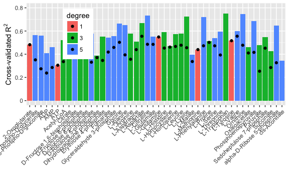

Figure 5 results
================
Aleksej Zelezniak
2018-10-19

Machine Learning Regression Predicts the Concentration of Metabolite Pools from Enzyme Abundance

    ## Warning: package 'tidyverse' was built under R version 3.4.2

    ## -- Attaching packages ------------------------------------------------------------------------------------------------------------------------------------------------------------------------------------------------------------ tidyverse 1.2.1 --

    ## <U+221A> ggplot2 2.2.1     <U+221A> purrr   0.2.5
    ## <U+221A> tibble  1.4.2     <U+221A> dplyr   0.7.6
    ## <U+221A> tidyr   0.8.1     <U+221A> stringr 1.3.1
    ## <U+221A> readr   1.1.1     <U+221A> forcats 0.3.0

    ## Warning: package 'tibble' was built under R version 3.4.3

    ## Warning: package 'tidyr' was built under R version 3.4.4

    ## Warning: package 'purrr' was built under R version 3.4.4

    ## Warning: package 'dplyr' was built under R version 3.4.4

    ## Warning: package 'stringr' was built under R version 3.4.4

    ## Warning: package 'forcats' was built under R version 3.4.3

    ## -- Conflicts --------------------------------------------------------------------------------------------------------------------------------------------------------------------------------------------------------------- tidyverse_conflicts() --
    ## x dplyr::filter() masks stats::filter()
    ## x dplyr::lag()    masks stats::lag()

    ## Warning: package 'scales' was built under R version 3.4.1

    ## 
    ## Attaching package: 'scales'

    ## The following object is masked from 'package:purrr':
    ## 
    ##     discard

    ## The following object is masked from 'package:readr':
    ## 
    ##     col_factor

    ## Warning: package 'gridExtra' was built under R version 3.4.1

    ## 
    ## Attaching package: 'gridExtra'

    ## The following object is masked from 'package:dplyr':
    ## 
    ##     combine

``` r
#iMM904 yeast metabolic model
load("./data/iMM904._load_.RData")
#experiment metadata
load("./data/exp_metadata._clean_.RData")

#models
load("./data/all_final_models.models_summary2.RData")
load("./data/file.list.models_summary2.RData")

#ID maps
metabolite.order <- read_delim("./data/metabolites.txt", delim = "\t")
#> Parsed with column specification:
#> cols(
#>   met_name = col_character(),
#>   metabolite = col_character(),
#>   pathway = col_character(),
#>   method = col_character(),
#>   Order = col_integer()
#> )
load("./data/metabolite2iMM904._load_.RData")
load("./data/gene.annotations._load_.RData")
load("./data/orf2name._clean_.RData")
```

### Figure 5C

``` r

metabolites.models.long <- all_final_models %>% 
  filter(isImputed == 0, metabolite != "Glu") %>%
  dplyr::select(model, RMSE, Rsquared, normalization, dataset, metabolite, degree, preprocessing) %>% 
  distinct() %>%
  group_by(metabolite, normalization, degree, preprocessing) %>%
  filter(RMSE == min(RMSE,na.rm = T)) %>%
  group_by(metabolite, degree) %>%
  filter(Rsquared == max(Rsquared,na.rm = T))

length(unique(all_final_models$model))
#> [1] 12


metabolite.order = metabolite.order[with(metabolite.order,order(desc(method),pathway,Order, met_name)),]


toPlot <- metabolites.models.long %>% filter(metabolite %in% metabolite.order$metabolite)


toPlot <- toPlot %>% mutate(met_name = metabolite.order$met_name[match(metabolite, metabolite.order$metabolite)],
                            met_name = fct_relevel(met_name, levels=as.character(metabolite.order$met_name)),
                            pathway = metabolite.order$pathway[match(metabolite, metabolite.order$metabolite)],
                            pathway = fct_relevel(pathway,levels = unique(as.character(metabolite.order$pathway))))

tests.pvals <- toPlot %>% 
  group_by(degree) %>% 
  summarise(p.value1 = wilcox.test(toPlot$Rsquared[toPlot$degree == 1], Rsquared)$p.value,
            p.value3 = wilcox.test(toPlot$Rsquared[toPlot$degree == 3], Rsquared)$p.value) %>% 
  as.data.frame() %>% 
  gather(variable, value, -degree) %>% 
  filter(value != 1) %>%
  group_by(degree, variable) %>%
  mutate(Rsquared = jitter(0.7,0.2))


toPlot %>%
  ggplot(aes(x=degree, y = Rsquared, fill = degree)) +
    stat_boxplot(geom ='errorbar', width = 0.5) +
    geom_boxplot() +
    ylab(expression(paste("Cross-validated ", R^2, sep=""))) +
    xlab("Network distance") +
    geom_text(data=tests.pvals, aes(label=format(value, scientific=T))) +
    theme_bw() +
    theme(legend.position="none",
          panel.grid = element_blank())
```

 \#\#\#Figure 5B

``` r
toPlot.points <- toPlot %>% 
  group_by(metabolite) %>%
  filter(degree == 1) %>%
  filter(Rsquared == max(Rsquared,na.rm = T))

toPlot <- toPlot %>% 
  group_by(metabolite) %>%
  filter(Rsquared == max(Rsquared,na.rm = T))
toPlot %>%
  ggplot(aes(x = met_name, y = Rsquared, fill=degree)) +
    geom_bar(position="dodge", stat = "identity") +
    geom_point(data = toPlot.points, aes(x = met_name, y = Rsquared)) +
    ylab(expression(paste("Cross-validated ", R^2, sep=""))) +
    xlab("") +
    scale_y_continuous(breaks = seq(0, 1, 0.2), labels = as.character(seq(0, 1, 0.2)), limits = c(0,0.8)) +
    theme(axis.text.x = element_text(angle = 45, hjust = 1), legend.position = c(0.2, 0.7))
  
```



``` r
sessionInfo()
#> R version 3.4.0 (2017-04-21)
#> Platform: x86_64-apple-darwin15.6.0 (64-bit)
#> Running under: macOS  10.13.5
#> 
#> Matrix products: default
#> BLAS: /Library/Frameworks/R.framework/Versions/3.4/Resources/lib/libRblas.0.dylib
#> LAPACK: /Library/Frameworks/R.framework/Versions/3.4/Resources/lib/libRlapack.dylib
#> 
#> locale:
#> [1] C
#> 
#> attached base packages:
#> [1] stats     graphics  grDevices utils     datasets  methods   base     
#> 
#> other attached packages:
#>  [1] bindrcpp_0.2.2  gridExtra_2.3   scales_0.5.0    forcats_0.3.0  
#>  [5] stringr_1.3.1   dplyr_0.7.6     purrr_0.2.5     readr_1.1.1    
#>  [9] tidyr_0.8.1     tibble_1.4.2    ggplot2_2.2.1   tidyverse_1.2.1
#> 
#> loaded via a namespace (and not attached):
#>  [1] Rcpp_0.12.18     cellranger_1.1.0 pillar_1.2.1     compiler_3.4.0  
#>  [5] plyr_1.8.4       bindr_0.1.1      tools_3.4.0      digest_0.6.15   
#>  [9] lubridate_1.7.4  jsonlite_1.5     evaluate_0.10.1  nlme_3.1-131.1  
#> [13] gtable_0.2.0     lattice_0.20-35  pkgconfig_2.0.1  rlang_0.2.2     
#> [17] psych_1.8.4      cli_1.0.0        rstudioapi_0.7   yaml_2.2.0      
#> [21] parallel_3.4.0   haven_1.1.1      xml2_1.2.0       httr_1.3.1      
#> [25] knitr_1.20       hms_0.4.1        rprojroot_1.3-2  grid_3.4.0      
#> [29] tidyselect_0.2.4 glue_1.3.0       R6_2.2.2         readxl_1.0.0    
#> [33] foreign_0.8-69   rmarkdown_1.9    modelr_0.1.1     reshape2_1.4.3  
#> [37] magrittr_1.5     backports_1.1.2  htmltools_0.3.6  rvest_0.3.2     
#> [41] assertthat_0.2.0 mnormt_1.5-5     colorspace_1.3-2 stringi_1.2.2   
#> [45] lazyeval_0.2.1   munsell_0.4.3    broom_0.4.4      crayon_1.3.4
```
